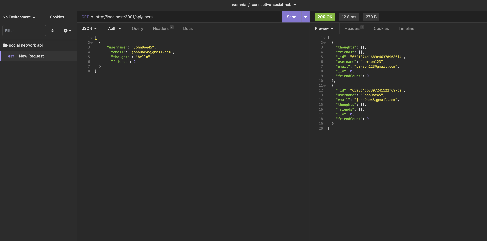
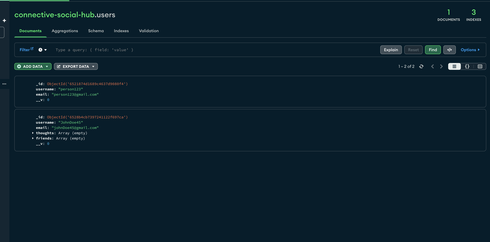

# Challenge 18: Connective Social Hub

## Description
An API built for a social network web application where users can share their thoughts, react to friends' thoughts, and create a friend list. The application uses Express.js for routing, MongoDB database, and Mongoose ODM. 

A walkthough [video](https://drive.google.com/file/d/1-342xg7RAR_D0x5dSeMyjqxv-W0Wx7cN/view?usp=drive_link) of GET routes for all users with screenshots deomonstrating below from Insomnia and MongoDb. 

  ## Table of Contents
  * [Installation](#installation)
  * [Usage](#usage)
  * [License](#license)
  * [Badges](#badges)
  * [Contributions](#contributions)
  * [Questions](#questions)

## [Installation](#Table-of-Contents)
1. Clone this repo to your local computer by clicking the link to my [Github](https://github.com/lizf57/connective-social-hub) then clicking the green drop down button that says "Code".
2. Install dependencies by typing `npm install` in the terminal's command line.

## [Usage](#table-of-contents)

To invoke the application, type `npm run` then `node server.js` in the command line. The application can be run through Insomnia to test API endpoints. 

## [License](#table-of-contents)
[MIT License](https://opensource.org/licenses/MIT)

## [Badges](#table-of-contents)

## [Contributions](#table-of-contents)
There were no other contributors to this application. This application was initiated as a project from the University of Wisconsin Coding Bootcamp.  

## [Questions](#Table-of-Contents)
If you have any questions contact the developer here:
L. Friedman:   [GitHub](https://github.com/lizf57)
